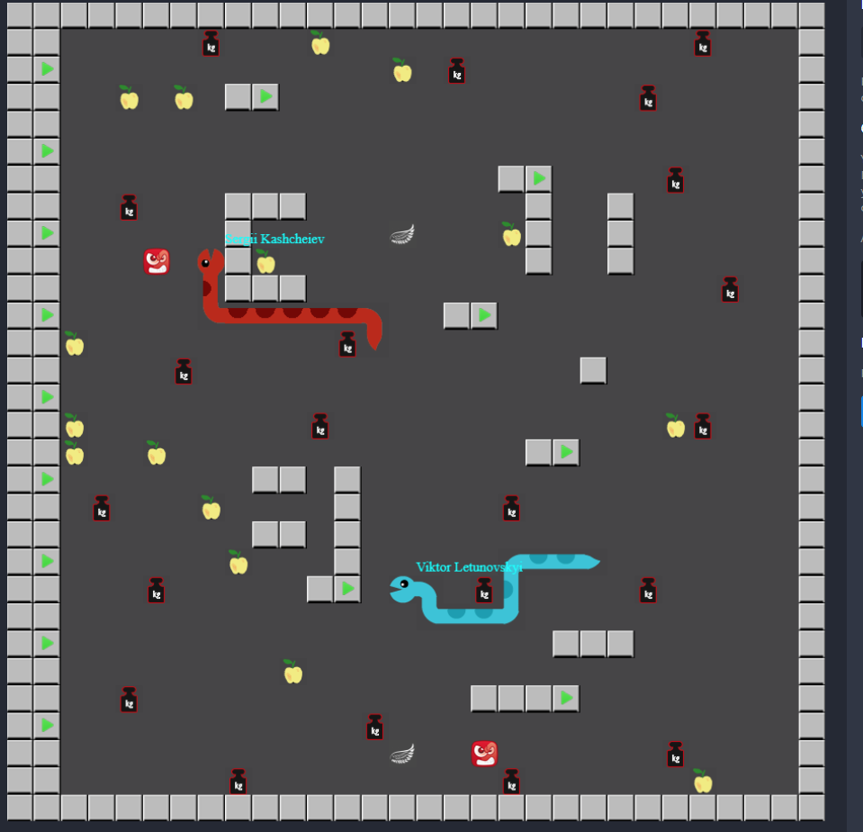

# Snake Battle

## About game
You have to write a snake bot that will beat other bots by points. All players play on the same field. Snake can move to empty cells in four directions but cannot move to the previous cell.

On its path, a snake can encounter stones, gold, fury pills, flying pills, apples or other snakes. If the snake eats a stone, it becomes shorter by 4 cells. If its length is less than 2, it dies. For gold, apples and dead competitors the snake gets bonus points. For its own death and eaten stones, the snake gets demerit points. The points are summed up.

The player with most points when time expires wins. A dead snake immediately vanishes and reappears on one of the respawn cells, waiting for the next round (start event).

**Negative impact:**
- Snake that hits a wall, dies.
- Snake that hits another snake, dies.
- Snake must be at least two cells long or it dies.
- Snake that eats a stone becomes three cells shorter, and, if that makes it shorter than two cells - it dies.

**Positive impact:**
- Snake that eats an apple becomes longer by one cell.
- Snake that eats a flying pill flies over stones and other snakes for 10 moves.
- Snake that eats a fury pill can bite off parts of other snakes and eat stones without negative effects for 10 moves.
- Snake that eats gold gets bonus points.

**Exceptional cases:**
- Snakes can bite off their own tails, becoming shorter without any negative effects.
- If two snakes collide head-on, the shortest snake dies. The surviving snake becomes shorter - by the length of the dead one (if that makes it shorter than two cells, it dies as well).
- The bitten off part of the tail always disappears, and the snake is shortened.
- If two snakes, one of which is under the flying pill, collide, nothing happens.
- If two snakes collide, the under the fury pill always wins.
- If two furious snakes collide, common collision rules are used.

*Good luck and let the smartest ass win!*

## Field:

# Setup

## For NonJava languages:
- please go to .\src\main\<language>
- chose your language
- and follow README.md instructions

## For Java:
- setup Java (JDK 11)
    + setup JAVA_HOME variable
- setup Maven3
    + setup M2_HOME variable
    + setup Path variable
    + open cmd and run command 'mvn -version' it should print valid java and maven location
- import this project as Maven project into Intellij Idea (Eclipse/ is not recommended)
- please install Engine dependency
    + on page http://server/codenjoy-contest/help
        * you can download zip with dependency
            - server = server_host_ip:8080 server ip inside your LAN
            - server = codenjoy.com if you play on http://codenjoy.com/codenjoy-contest
        * on this page you can also read game instructions
- register your hero on server http://server/codenjoy-contest/register
- in class .\src\main\java\com\codenjoy\dojo\<gamename>\client\YourSolver.java
    + copy board page browser url from address bar and paste into main method
    + implement logic inside method
        * public String get(Board board) {
    + run main method of YourSolver class
    + on page http://server/codenjoy-contest/board/game/<gamename> you can check the leaderboard - your bot should move
    + if something changed - restart the process
        * warning! only one instance of YourSolver class you can run per player - please check this
- in class .\src\main\java\com\codenjoy\dojo\<gamename>\client\Board.java
    + you can add you own methods for work with board
- in test package .\src\test\java\com\codenjoy\dojo\<gamename>\client
    + you can write yor own test
- Codenjoy!